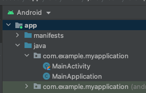

# Android: 알림 아이콘 설정


알림 아이콘 변경이 지원되는 SDK 버전을 반드시 확인해주세요.

Android SDK: 1.0.11 이상

React Native SDK: 1.0.9 이상

Flutter SDK: 1.0.2 이상


안드로이드 앱을 운영하시는 경우 알림 아이콘 변경이 가능합니다. 아이콘 변경을 위해 별도의 코드 추가가 필요한 것은 아니며, **아이콘을 만들 때 리소스 이름을 규칙에 맞게 설정**해주시면 플레어레인 SDK가 자동으로 알림 아이콘을 인식합니다.

본 가이드에서는 Android Studio를 통해 아이콘을 생성해보겠습니다.

## 1. Android Studio로 프로젝트 열기

정상적인 Android 프로젝트를 여셨다면 다음과 같이 Android 프로젝트로 인식하게 됩니다.

## 2. Image Asset 생성 창 열기

루트 프로젝트 오른쪽 마우스 클릭 후 New -> Image Asset 선택

## 3. 알림 아이콘 생성하기


안드로이드 정책 상 알림 아이콘은 투명 배경의 아이콘이어야합니다.


a. Icon Type에 'Notification Icons' 선택

b. Name에 `ic_stat_flarelane_default` 입력 <mark style="color:red;"></mark> <mark style="color:red;"></mark><mark style="color:red;">**(중요!)**</mark>

c. Asset Type에 'Image' 선택 후 사용할 아이콘 이미지 첨부

## 4. 변경된 아이콘 확인

아이콘 생성이 잘 되었다면 다시 앱 빌드를 하여 푸시를 보내보았을 때 정상적으로 바뀐 모습을 확인하실 수 있습니다.

