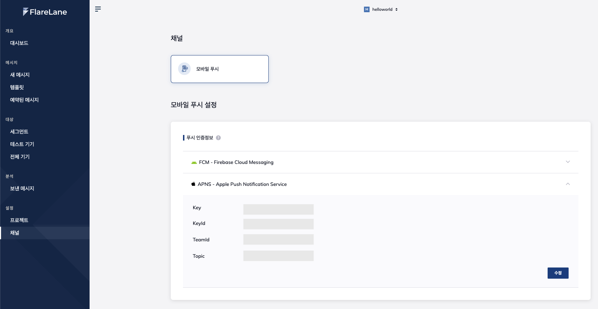

# APNS 인증 정보 설정

FlareLane에서 APNS 설정을 위해서는 아래 값들을 필요로 합니다.

* Key (.p8 확장자의 파일 형태)
* Key ID
* Team ID
* Topic (iOS 앱의 Bundle ID)

## 1. 사전 체크


개발하는 앱의 Bundle ID(Topic)가 Apple Developer 내 미리 등록된 상태에서 Key 생성이 되야 합니다.&#x20;


Apple Developer 내 [Identifiers 페이지](https://developer.apple.com/account/resources/identifiers/list)에서 개발하는 앱의 identifier가 리스트에 있는지 확인합니다. Xcode에서 같은 계정으로 개발을 하고 계셨다면 Xcode에 의해 자동으로 등록되었을 수 있습니다.

## 1. Push Notification 키 생성 (Key, Key ID)

1\. Apple Developer 내 [Key 페이지](https://developer.apple.com/account/resources/authkeys/list)에서 "Apple Push Notifications service" 가 활성화된 키를 생성합니다.

2\. 키 생성이 완료되면 .p8 파일을 다운받고 Key ID 를 복사해둡니다.&#x20;

## 2. Team ID 확인

Apple Developer 내 [Membership 페이지](https://developer.apple.com/account/#!/membership)에서 Team ID 를 확인하실 수 있습니다

## 3. 플레어레인 연동

2에서 확인한 인증 정보를 플레어레인 채널 설정 '모바일 푸시' 중 APNS 입력란에 차례로 입력합니다.

